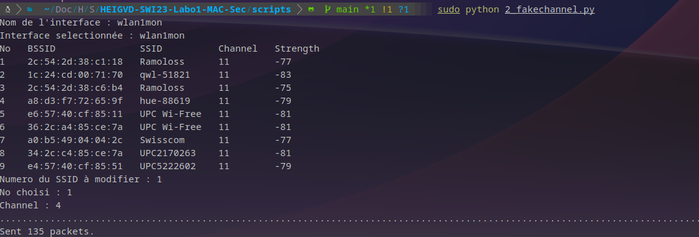
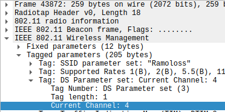
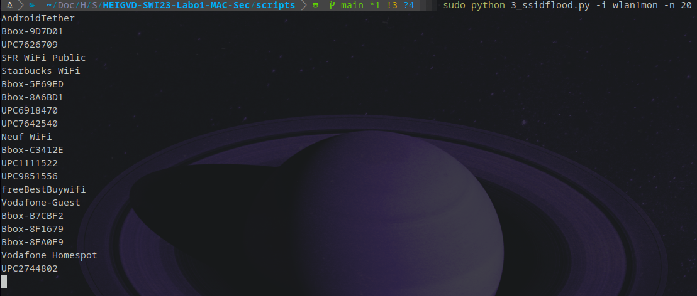
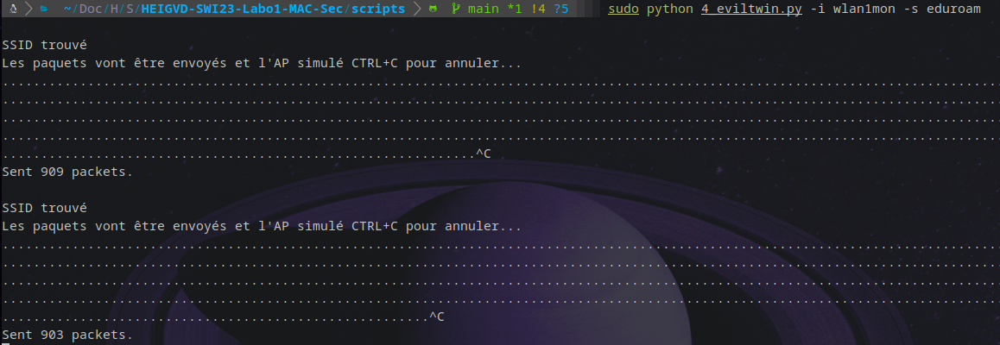
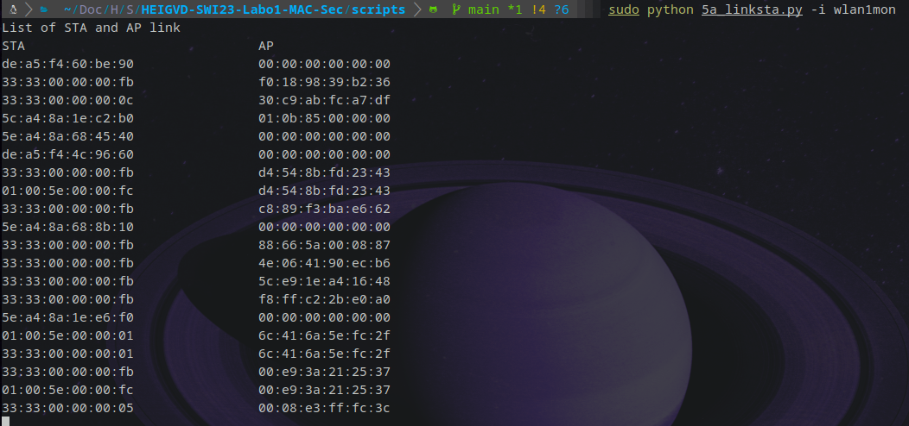

---
title: "Laboratoire #1"
subtitle: "SWI 2023"
author: "Alexandre Jaquier, Géraud Silvestri, Francesco Monti"
date: 25.03.2023
toc-own-page: true
titlepage-logo: heig-logo.png
...

# Partie 1 : Beacons, authentication
## 1. Deauthentication attack
### Question a)
> Quel code est utilisé par aircrack pour déauthentifier un client 802.11. Quelle est son interpretation ?

On utilise `aireplay-ng` pour déauthentifier un client 802.11. Le code utilisé est 7, qui correspond à `Deauthentication because sending STA is leaving (or has left) IBSS or ESS` (cf. [IEEE 802.11-2016](https://standards.ieee.org/standard/802_11-2016.html#ref-IEEE80211-2016-Table-8-1)).

> A l'aide d'un filtre d'affichage, essayer de trouver d'autres trames de déauthentification dans votre capture. Avez-vous en trouvé d'autres ? Si oui, quel code contient-elle et quelle est son interpretation ?

Les trames de déauthentification que nous avons trouvées sont les suivantes :

Le code 6 signifie que la STA a reçu une trame de déauthentification de la part de l'AP. La STA a donc été déconnectée de l'AP.

### Question b)
> Quels codes/raisons justifient l'envoie de la trame à la STA cible et pourquoi ?

- Code 1: `Unspecified reason` -> La STA a reçu une trame de déauthentification sans raison spécifique.
- Code 4: `Disassociated because sending STA is leaving (or has left) BSS` -> La STA a reçu une trame de déauthentification car elle a quitté le réseau.
- Code 5: `Disassociated because AP is unable to handle all currently associated STAs` -> La STA a reçu une trame de déauthentification car l'AP n'est pas capable de gérer toutes les STA associées.

> Quels codes/raisons justifient l'envoie de la trame à l'AP et pourquoi ?

- Code 1: `Unspecified reason` -> L'AP a reçu une trame de déauthentification sans raison spécifique.
- Code 8: `Disassociated because sending STA is leaving (or has left) BSS` -> L'AP a reçu une trame de déauthentification car la STA a quitté le réseau.

> Comment essayer de déauthentifier toutes les STA ?

On peut utiliser l'adresse MAC FF:FF:FF:FF:FF:FF comme adresse MAC de destination car elle va être retransmise à toutes les STA (broadcast). Donc toutes les stations connectées à l'AP vont recevoir la trame de déauthentification.

> Quelle est la différence entre le code 3 et le code 8 de la liste ?

Le code 3 signifie que la STA a reçu une trame de déauthentification de la part de l'AP. La STA a donc été déconnectée de l'AP. Le code 8 signifie que l'AP a reçu une trame de déauthentification de la part de la STA. L'AP a donc déconnecté la STA.

> Expliquer l'effet de cette attaque sur la cible

L'attaque va déconnecter la cible de l'AP. La cible ne pourra plus se connecter à l'AP tant que l'attaque n'est pas arrêtée et que la cible ne s'est pas reconnectée.

*Script* : [1_deauth.py](scripts/1_deauth.py)

\pagebreak
## 2. Fake channel evil tween attack
### Question a)
> Expliquer l'effet de cette attaque sur la cible

L'attaque va simuler un réseau WiFi avec le même SSID que le réseau cible. La cible va donc se connecter au réseau WiFi faux et va donner ses identifiants au faux AP. Le faux AP va ensuite intercepter les données de la cible et les envoyer au vrai AP. Le vrai AP va donc recevoir les données de la cible sans que la cible ne s'en rende compte.

*Script* : [2_fakechannel.py](scripts/2_fakechannel.py)

\pagebreak
## 3. SSID flood attack

*Script* : [3_ssidflood.py](scripts/3_ssidflood.py)

\pagebreak
# Partie 2 : Probes
## 4. Probe Request Evil Twin Attack
> Comment ça se fait que ces trames puissent être lues par tout le monde ? Ne serait-il pas plus judicieux de les chiffrer ?

Les trames _Probe Request_ doivent être en clair pour que les AP puissent les lire et savoir si un client est à proximité. Si les trames étaient chiffrées, les AP ne pourraient pas forcément les lire et donc ne pourraient pas envoyer de trames _Probe Response_ en retour.

> Pourquoi les dispositifs iOS et Android récents ne peuvent-ils plus être tracés avec cette méthode ?

Les dispositifs iOS et Android utilisent des adresses MAC aléatoires pour les trames _Probe Request_. Ceci rend le traçage des dispositifs iOS et Android plus difficile.

*Script* : [4_eviltwin.py](scripts/4_eviltwin.py)

\pagebreak
## 5. Détection de clients et réseaux
### Question a)
Le script va chercher tous les clients connectés à un réseau. Pour cela, il va regarder toutes les trames _Probe Response_ et va extraire l'adresse MAC de la STA. Il va ensuite afficher les adresses MAC des STAs qui sont connectées à un réseau et leur AP associé.

*Script* : [5a_linksta.py](scripts/5a_linksta.py)

### Question b)
Le script va chercher tous les clients qui cherchent un réseau. Pour cela, il va regarder toutes les trames _Probe Request_ et va extraire l'adresse MAC de la STA. Il va ensuite afficher les adresses MAC des STAs qui cherchent un réseau.

*Script* : [5b_liststa.py](scripts/5b_liststa.py)

\pagebreak
## 6. Hidden SSID reveal
> Expliquer en quelques mots la solution que vous avez trouvée pour ce problème ?

Chaque trame _Beacon_ est analysé et on extrait le BSSID. Chaque trame _Probe Response_ est analysée et on vérifie si le BSSID de la trame correspond au BSSID de la trame _Beacon_. Si c'est le cas, on affiche le SSID de la trame _Probe Response_.

Si un appareil se connecte à un réseau caché, il va envoyer une trame _Probe Request_ avec le SSID du réseau caché. L'AP va alors envoyer une trame _Probe Response_ avec le SSID du réseau caché. De cette manière on peut retrouver le SSID du réseau caché et poursuivre l'analyse.

*Script* : [hidden_ssid.py](scripts/6_hiddenssid.py)

## Annexe
Tous les scripts sont disponibles dans le dossier [scripts](scripts/). Un environnement conda à été utilisé pour l'installation des dépendances. Le fichier [environment.yml](scripts/environment.yml) contient les dépendances utilisées.